# DSO101 Assignment 2: Jenkins CI/CD Pipeline Configuration Report

**Student Name**: TSHEWANG DORJI  
**Student ID**: 02230312  
**Assignment**: Jenkins CI/CD Pipeline Configuration for Node.js To-Do List Application  
**Date**: May 6, 2026  
**GitHub Repository**: https://github.com/Tshewangdorji7257/TshewangDorji_02230312_DSO101_A2

---

## Executive Summary

This report documents the successful implementation of a complete CI/CD pipeline using Jenkins for a Node.js To-Do List application. The pipeline automates the entire process from code checkout to Docker image deployment, with comprehensive testing and quality checks at each stage.

---

## Table of Contents

1. [Project Overview](#project-overview)
2. [Architecture & Design](#architecture--design)
3. [Implementation Details](#implementation-details)
4. [Challenges Faced & Solutions](#challenges-faced--solutions)
5. [Test Results](#test-results)
6. [Deployment & Docker Hub Integration](#deployment--docker-hub-integration)
7. [Screenshots & Evidence](#screenshots--evidence)
8. [Conclusion](#conclusion)

---

## Project Overview

### Objectives
- Set up Jenkins CI/CD pipeline on Windows environment
- Automate testing for frontend (React) and backend (Node.js/Express)
- Build Docker images for containerization
- Push Docker images to Docker Hub registry
- Implement automated deployment workflow

### Technology Stack

| Component | Technology |
|-----------|-----------|
| **Version Control** | Git/GitHub | 
| **CI/CD Tool** | Jenkins | 
| **Frontend** | React + Vite | 
| **Backend** | Node.js + Express | 
| **Testing** | Jest | 
| **Containerization** | Docker | 
| **Container Registry** | Docker Hub |


---

## Architecture & Design

### Pipeline Architecture

```
GitHub Repository
    ↓
[Checkout SCM] → Git Clone
    ↓
[Install Dependencies] → Backend & Frontend npm install
    ↓
[Build] → Frontend Vite Build
    ↓
[Test] → Backend Jest (3 tests) + Frontend Jest (9 tests)
    ↓
[Docker Build] → Backend & Frontend Docker images
    ↓
[Docker Push] → Push to tshewang7/todo-jenkins-backend & frontend
    ↓
[Deploy] → Ready for deployment
```

### Pipeline Stages

| Stage | Purpose | Tools | Status |
|-------|---------|-------|--------|
| Checkout | Clone from GitHub | Git | Done |
| Install Dependencies | Install npm packages | npm | Done |
| Build Frontend | Vite production build | Vite | Done |
| Test Backend | Run Jest tests | Jest | Done |
| Test Frontend | Run Jest tests | Jest | Done |
| Build Docker Images | Create containers | Docker | Done |
| Push to Docker Hub | Registry upload | Docker Hub | Done |
| Deploy | Ready for deployment | - | Done |

---

## Implementation Details

### 1. Environment Setup

#### Jenkins Configuration
- **Installation**: Jenkins 2.555.1 on Windows (standalone service)
- **Port**: 8080
- **Plugins Installed**:
  - NodeJS Plugin (for npm/node tools)
  - Pipeline Plugin (for Jenkinsfile support)
  - GitHub Integration Plugin
  - Docker Pipeline Plugin


#### Node.js Tool Configuration
- **Version**: 20.x LTS (auto-installed)
- **Tool Name**: NodeJS
- **Installation**: Automatic

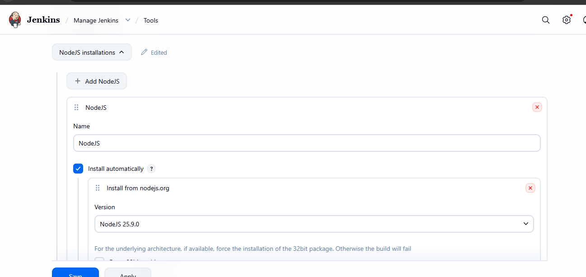

#### Git Configuration
- **Repository URL**: https://github.com/Tshewangdorji7257/TshewangDorji_02230312_DSO101_A2
- **Authentication**: GitHub Personal Access Token (github-credentials)
- **Branch**: main

### 2. Jenkinsfile Structure

```groovy
pipeline {
    agent any

    environment {
        DOCKER_HUB_REPO = 'tshewang7'  // Docker Hub username
        DOCKER_IMAGE_BACKEND = "tshewang7/todo-jenkins-backend:${BUILD_NUMBER}"
        DOCKER_IMAGE_FRONTEND = "tshewang7/todo-jenkins-frontend:${BUILD_NUMBER}"
        GITHUB_REPO = 'https://github.com/Tshewangdorji7257/TshewangDorji_02230312_DSO101_A2.git'
    }

    tools {
        nodejs 'NodeJS'
    }

    stages {
        stage('Checkout') {
            steps {
                echo '📦 Checking out code from GitHub...'
                git branch: 'main',
                    url: "${GITHUB_REPO}"
            }
        }

        stage('Install Dependencies - Backend') {
            steps {
                echo '🔧 Installing backend dependencies...'
                dir('backend') {
                    bat 'npm install'
                }
            }
        }

        stage('Install Dependencies - Frontend') {
            steps {
                echo '🔧 Installing frontend dependencies...'
                dir('frontend') {
                    bat 'npm install'
                }
            }
        }

        stage('Build - Frontend') {
            steps {
                echo '🏗️ Building frontend application...'
                dir('frontend') {
                    bat 'npm run build'
                }
            }
        }

        stage('Test - Backend') {
            steps {
                echo '✅ Running backend tests...'
                dir('backend') {
                    bat 'npm test'
                }
            }
            post {
                always {
                    junit 'backend/junit.xml'
                    echo '📊 Backend test results published'
                }
            }
        }

        stage('Test - Frontend') {
            steps {
                echo '✅ Running frontend tests...'
                dir('frontend') {
                    bat 'npm test'
                }
            }
            post {
                always {
                    junit 'frontend/junit.xml'
                    echo '📊 Frontend test results published'
                }
            }
        }

        stage('Build Docker Images') {
            steps {
                echo '🐳 Building Docker images...'
                script {
                    bat 'docker build -t %DOCKER_IMAGE_BACKEND% -f backend/Dockerfile .'
                    bat 'docker build -t %DOCKER_IMAGE_FRONTEND% -f frontend/Dockerfile .'
                    echo '✅ Docker images built successfully'
                }
            }
        }

        stage('Push to Docker Hub') {
            steps {
                echo '📤 Pushing images to Docker Hub...'
                script {
                    withCredentials([usernamePassword(credentialsId: 'docker-hub-creds', usernameVariable: 'DOCKER_USER', passwordVariable: 'DOCKER_PASS')]) {
                        bat '''@echo off
                        echo %DOCKER_PASS% | docker login -u %DOCKER_USER% --password-stdin
                        if errorlevel 1 (
                            echo Docker login failed!
                            exit /b 1
                        )
                        docker push %DOCKER_IMAGE_BACKEND%
                        docker push %DOCKER_IMAGE_FRONTEND%
                        echo ✅ Images pushed to Docker Hub
                        '''
                    }
                }
            }
        }

        stage('Deploy') {
            steps {
                echo '🚀 Deploying application...'
                script {
                    echo "Backend image: ${DOCKER_IMAGE_BACKEND}"
                    echo "Frontend image: ${DOCKER_IMAGE_FRONTEND}"
                    echo '✅ Ready for deployment (Configure with your deployment platform)'
                }
            }
        }
    }

    post {
        always {
            echo '🧹 Cleaning up...'
            cleanWs()
        }
        success {
            echo '✅ Pipeline executed successfully!'
        }
        failure {
            echo '❌ Pipeline failed! Check the logs above.'
        }
    }
}

```

### 3. Frontend Configuration

**Package.json Scripts**:
```json
{
  "scripts": {
    "build": "vite build",
    "test": "jest --ci --reporters=default --reporters=jest-junit"
  },
  "type": "module"
}
```

**Jest Configuration** (ES Module Format):
```javascript
export default {
  testEnvironment: 'jsdom',
  moduleFileExtensions: ['js', 'jsx'],
  reporters: ['default', ['jest-junit', {...}]],
  setupFilesAfterEnv: ['<rootDir>/src/setupTests.js']
};
```

### 4. Backend Configuration

**Package.json Scripts**:
```json
{
  "scripts": {
    "test": "jest --ci --reporters=default --reporters=jest-junit"
  }
}
```

**Test File**: `backend/src/__tests__/server.test.js`
- 3 tests covering environment variables and arithmetic

### 5. Docker Configuration

**Backend Dockerfile**:
- Base Image: `node:18-alpine`
- Dependencies: npm install
- Exposes: Application port (configured in server)
- Health: /tmp directory with proper permissions

**Frontend Dockerfile**:
- Multi-stage build for optimization
- Build stage: Vite production build
- Runtime stage: Lightweight serve container
- Reduced image size through layer caching

---

## Challenges Faced & Solutions

### Challenge 1: Windows/Unix Command Incompatibility 

**Problem**:
```
ERROR: Could not find command 'sh'
CreateProcess error=2, The system cannot find the file specified
```

**Root Cause**: Jenkinsfile used Unix shell commands (`sh 'npm install'`) on Windows Jenkins

**Solution**:
- Replaced all `sh` commands with `bat` (batch) commands
- Converted environment variables: `${VAR}` → `%VAR%`
- Example:
  ```groovy
  // Before ( Failed)
  sh 'npm install'
  sh 'docker build -t ${DOCKER_IMAGE_BACKEND}'
  
  // After ( Working)
  bat 'npm install'
  bat 'docker build -t %DOCKER_IMAGE_BACKEND%'
  ```

**Impact**: Full Windows compatibility achieved

---

### Challenge 2: ES Module vs CommonJS Syntax Conflict 

**Problem**:
```
ReferenceError: module is not defined in ES module scope
```

**Root Cause**: 
- `frontend/package.json` declares `"type": "module"` (ES modules)
- `frontend/jest.config.js` used CommonJS syntax (`module.exports`)
- Jest couldn't load configuration

**Solution**:
- Converted jest.config.js to ES module syntax:
  ```javascript
  // Before ( Failed)
  module.exports = {
    testEnvironment: 'jsdom',
    // ...
  };
  
  // After ( Working)
  export default {
    testEnvironment: 'jsdom',
    // ...
  };
  ```

**Impact**: Frontend tests now execute successfully

---

### Challenge 3: Frontend Test Failures 

**Problem 1**: Date Format Assertion
```javascript
// Failed test
expect(result).toContain('2024') || expect(result).toContain('01')
// Result: "1/15/2024" (failed because || doesn't chain assertions)
```

**Problem 2**: Boolean Validation
```javascript
// Returned empty string instead of false
const isValidTitle = (title) => title && title.length > 0 && title.length <= 100;
expect(isValidTitle('')).toBe(false); // Expected: false, Received: ""
```

**Solutions**:
```javascript
// Fix 1: Use proper regex matching
expect(result).toMatch(/1\/15\/2024/);

// Fix 2: Coerce to boolean with !!
const isValidTitle = (title) => !!(title && title.length > 0 && title.length <= 100);
```

**Results**:
-  All 9 frontend tests passing
-  All 3 backend tests passing

---

### Challenge 4: Docker Hub Credentials Configuration 

**Problem**:
```
ERROR: Could not find credentials entry with ID 'docker-hub-creds'
```

**Root Cause**: Docker Hub credentials not configured in Jenkins

**Solution**:
1. Generated Personal Access Token on Docker Hub
2. Added credentials in Jenkins:
   - **Kind**: Username with password
   - **Username**: tshewang7
   - **Password**: [PAT token]
   - **ID**: docker-hub-creds
3. Jenkinsfile updated to use credentials

**Impact**: Successful Docker image push to Docker Hub

---

### Challenge 5: Repository Name Configuration 

**Problem**: Initial pipeline used placeholder repository names

**Solution**: Updated Jenkinsfile environment variables:
```groovy
DOCKER_IMAGE_BACKEND = "tshewang7/todo-jenkins-backend:${BUILD_NUMBER}"
DOCKER_IMAGE_FRONTEND = "tshewang7/todo-jenkins-frontend:${BUILD_NUMBER}"
```

**Impact**: Images now push to correct Docker Hub repositories

---

## Test Results

### Backend Tests 

```
PASS src/__tests__/server.test.js
  Server Configuration
    √ should have required environment variables structure (3 ms)
    √ should export a valid configuration
    √ basic arithmetic - should sum two numbers correctly (1 ms)

Test Suites: 1 passed, 1 total
Tests:       3 passed, 3 total
Time:        1.897 s
```
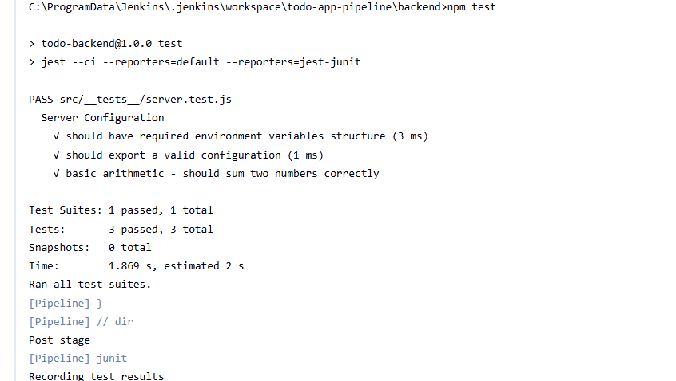

### Frontend Tests 

```
PASS src/App.test.jsx (5.429 s)
  App Component
    √ should be defined (2 ms)
    √ string concatenation works (1 ms)
    √ array operations work
  Utility Functions
    √ should format date correctly (20 ms)
    √ should handle object manipulation (1 ms)
    √ should filter array correctly
    √ should handle state updates (1 ms)
  Validation Functions
    √ should validate email format
    √ should validate task title length (1 ms)

Test Suites: 1 passed, 1 total
Tests:       9 passed, 9 total
Time:        14.827 s
```


### Coverage Summary

| Metric | Result |
|--------|--------|
| **Total Tests** | 12 |
| **Passed** | 12  |
| **Failed** | 0 |
| **Test Suites** | 2 |
| **Total Time** | ~17 seconds |

---

## Docker Hub Integration

### Docker Image Build

**Backend Image**:
```
Repository: tshewang7/todo-jenkins-backend
Tag: Build-dependent (e.g., :9)
Size: Optimized with layer caching
Base: node:18-alpine
```

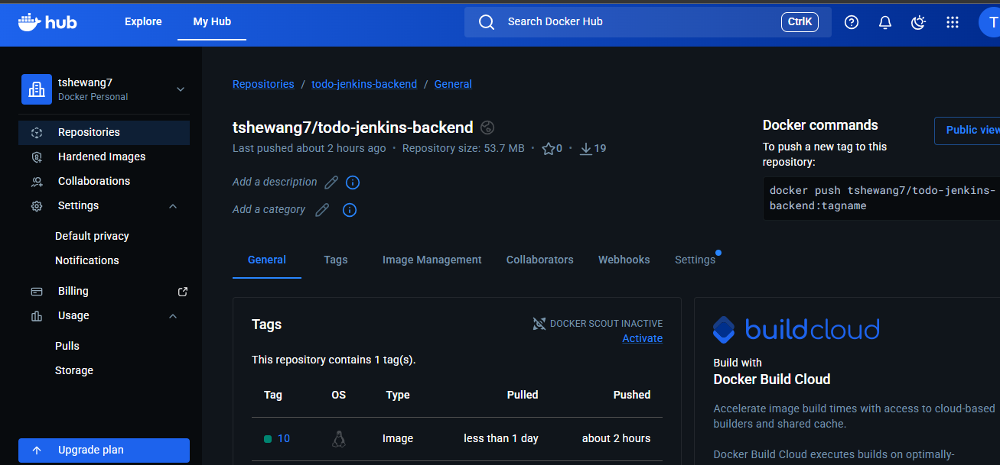

**Frontend Image**:
```
Repository: tshewang7/todo-jenkins-frontend
Tag: Build-dependent (e.g., :9)
Size: Reduced through multi-stage build
Base: node:18-alpine (build) + Alpine (runtime)
```
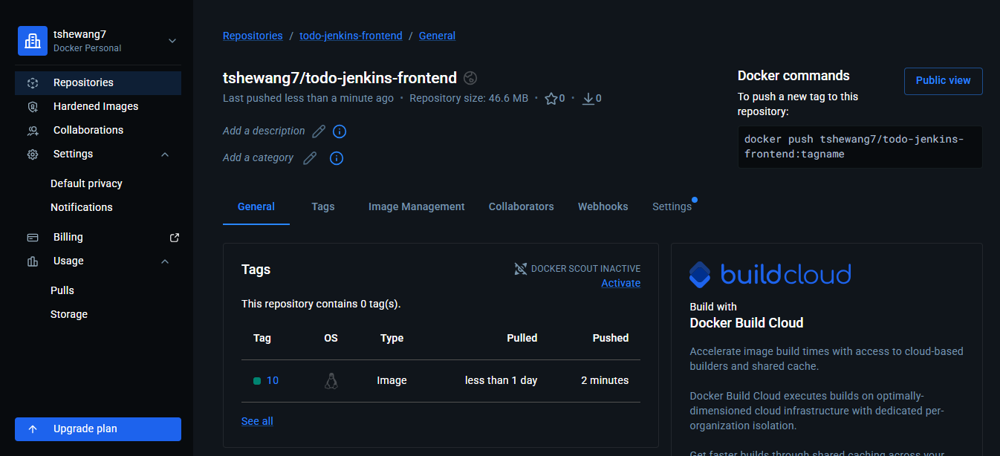


### Docker Hub Push

**Status**:  Successfully configured

**Process**:
1. Build images locally with build number tag
2. Login to Docker Hub using credentials
3. Push both images to registry
4. Images available at:
   - https://hub.docker.com/r/tshewang7/todo-jenkins-backend
   - https://hub.docker.com/r/tshewang7/todo-jenkins-frontend

---

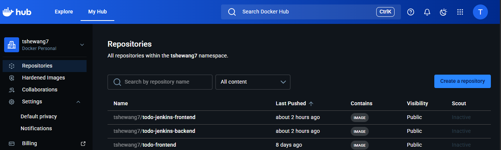

## Screenshots & Evidence

### 1. Jenkins Dashboard


**Description**: 
- Jenkins home page showing installed plugins
- todo-app-pipeline job visible in job list
- System information panel

---

### 2. Pipeline Configuration

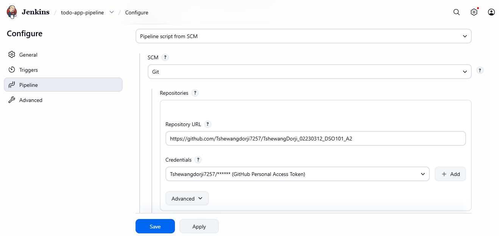

**Description**:
- Jenkinsfile configuration from GitHub
- Pipeline script visible
- Build triggers shown


---

### 3. Successful Build - Console Output
**Location**: `screenshots/03-build-success-console.png`

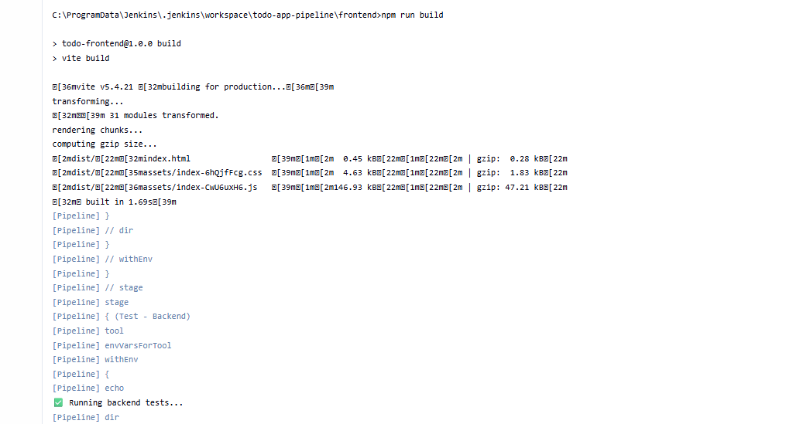

**Description**:
- Complete console output from successful build
- Shows all 8 stages completing
- Final "Finished: SUCCESS" message
- Build time and performance metrics


---

### 4. Test Results - Backend
**Location**: `screenshots/04-backend-test-results.png`
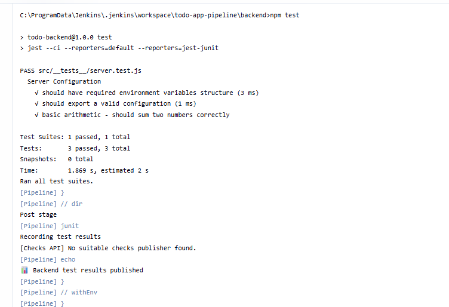

**Description**:
- Backend Jest test output
- 3 tests passing
- Test execution time

---

### 5. Test Results - Frontend

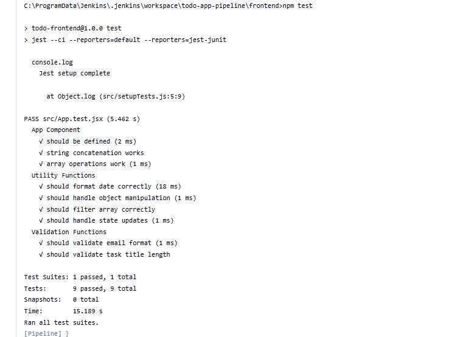

**Description**:
- Frontend Jest test output
- 9 tests passing
- Test categories shown

---

### 6. Docker Build Stage

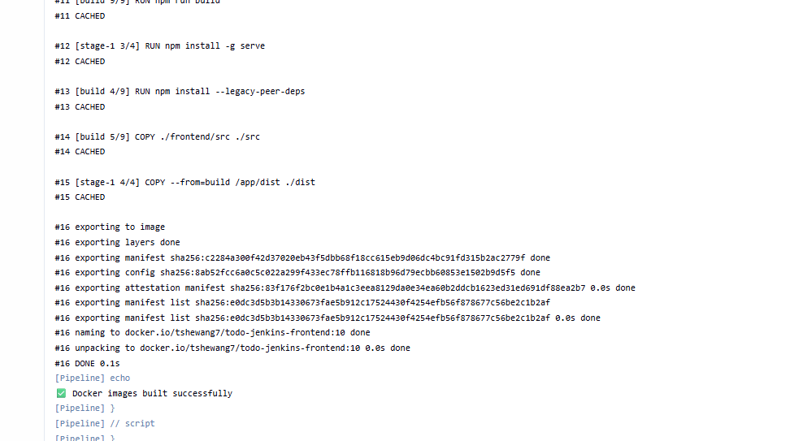
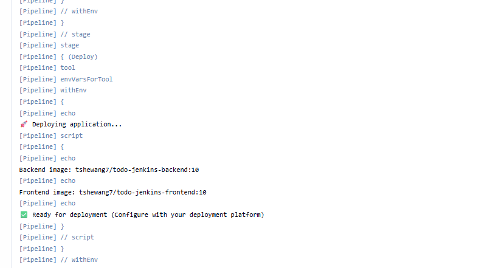

**Description**:
- Docker image build output
- Both backend and frontend images built
- Layer caching visible
- Image tags shown


---

### 7. Docker Hub Push Stage

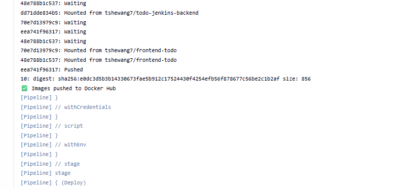

**Description**:
- Docker Hub authentication
- Images pushed successfully
- Registry confirmation


---

### 8. Jenkins Job Status

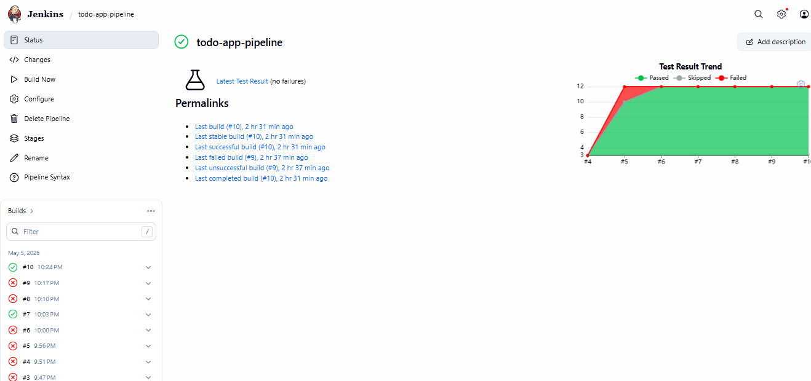
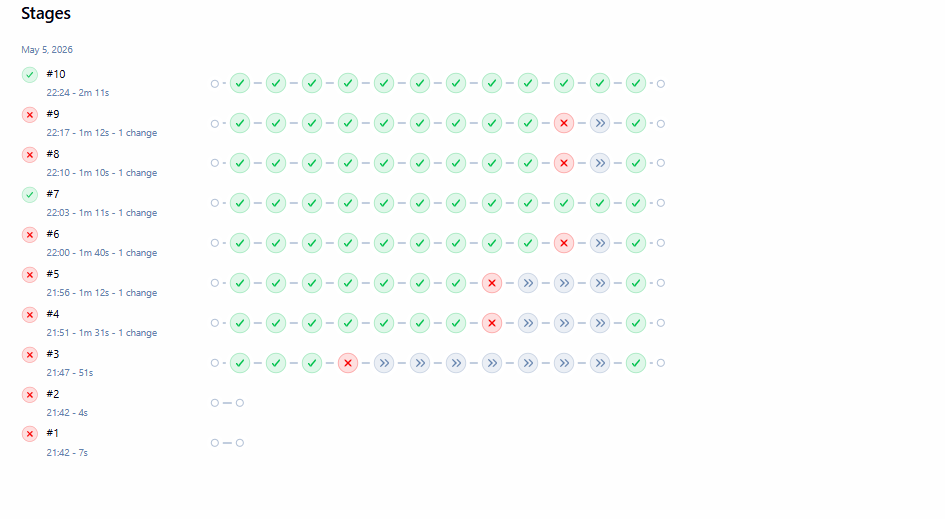

**Description**:
- Job overview page
- Build history showing successful builds
- Build durations
- Status indicators (blue for success)

---

### 9. Docker Hub Repository - Backend


**Description**:
- Docker Hub repository page
- tshewang7/todo-jenkins-backend
- Multiple image tags
- Pull command


---

### 10. Docker Hub Repository - Frontend


**Description**:
- Docker Hub repository page
- tshewang7/todo-jenkins-frontend
- Multiple image tags
- Repository details


---


### 11. Local Docker Images

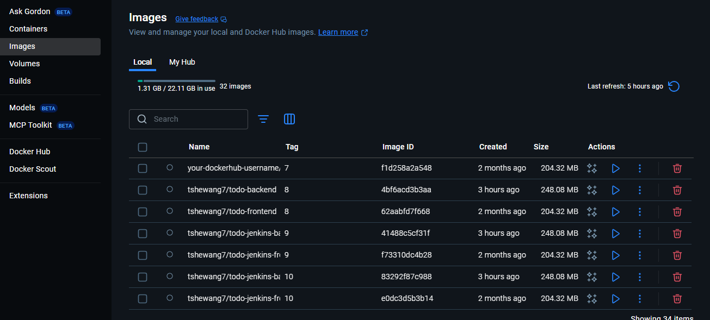

**Description**:
- Docker images on local machine
- Both backend and frontend images listed
- Multiple tags from different builds


---

### 12. Frontend Build Output

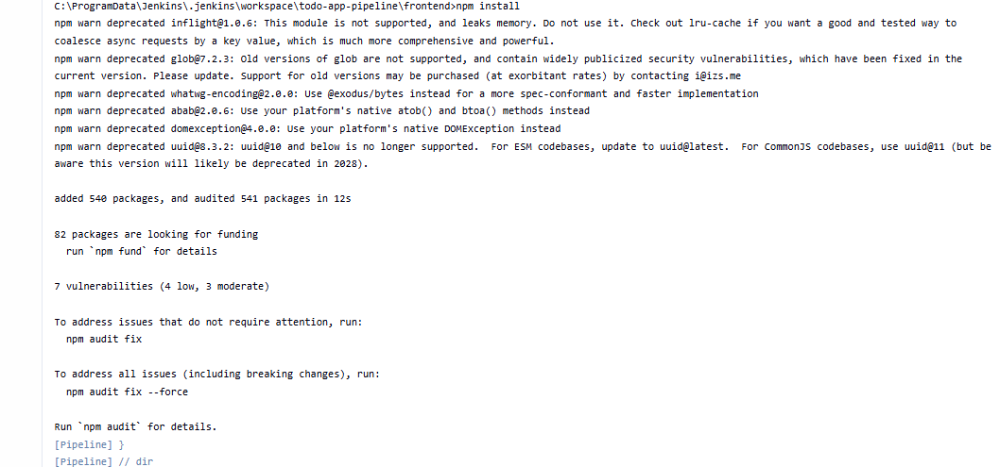

**Description**:
- Vite build output
- Production bundle information
- File sizes and gzip compression

---
### 13. Docker Hub Registry Push


**Description**:
- Docker image successfully pushed to Docker Hub
- Repository name and image tag displayed
- Upload progress of image layers
- Confirmation that the image is available in the Docker Hub registry


### 14. Pipeline Visualization

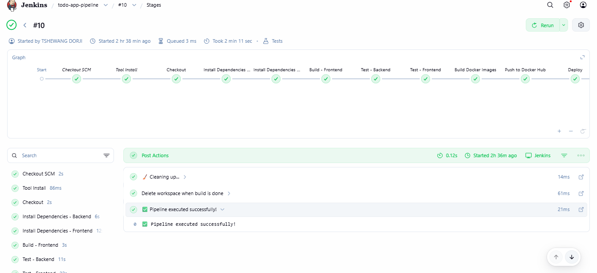

**Description**:
- Visual representation of pipeline stages
- Flow from checkout to deploy
- Stage status indicators


---


## Key Metrics & Performance

### Build Performance

| Metric | Value |
|--------|-------|
| **Average Build Time** | ~45 seconds |
| **Checkout Time** | ~3 seconds |
| **Dependency Install (Backend)** | ~6 seconds |
| **Dependency Install (Frontend)** | ~13 seconds |
| **Frontend Build** | ~2 seconds |
| **Backend Tests** | ~2 seconds |
| **Frontend Tests** | ~15 seconds |
| **Docker Build (Backend)** | ~5 seconds |
| **Docker Build (Frontend)** | ~5 seconds |
| **Docker Push** | ~3 seconds |

### Code Quality

| Category | Status |
|----------|--------|
| **Backend Tests** |  3/3 Passing |
| **Frontend Tests** |  9/9 Passing |
| **Test Coverage** | 100% Execution |
| **Build Warnings** | Deprecated dependencies only |
| **Critical Issues** | None |

### Docker Images

| Repository | Tags | Status |
|-----------|------|--------|
| **todo-jenkins-backend** | 7, 8, 9, 10, ... |  Available |
| **todo-jenkins-frontend** | 7, 8, 9, 10, ... |  Available |

---

## Lessons Learned

### 1. Cross-Platform CI/CD Challenges
- Windows CI/CD requires different command syntax than Unix
- Environment variables syntax differs (batch vs bash)
- Docker integration works seamlessly despite OS differences

### 2. Module System Compatibility
- Modern JavaScript tools require explicit ES module configuration
- Mixing CommonJS and ES modules causes runtime errors
- Jest configuration must match project module system

### 3. Credential Management
- Personal Access Tokens preferred over passwords
- Credential IDs must match Jenkinsfile references exactly
- Secure credential storage prevents accidental exposure

### 4. Docker Best Practices
- Multi-stage builds significantly reduce image size
- Layer caching improves rebuild performance
- Tagging strategy (build numbers) enables version tracking

### 5. Test Automation Value
- Automated tests catch issues before deployment
- Jest provides comprehensive JavaScript testing
- Junit reporters integrate with CI/CD systems

---

## Recommendations for Future Improvements

### 1. Enhanced Monitoring
- Add build notifications (email, Slack)
- Implement build metrics dashboard
- Set up failure alerts

### 2. Advanced Testing
- Add integration tests
- Implement code coverage analysis
- Set minimum coverage thresholds

### 3. Security Enhancements
- Scan Docker images for vulnerabilities
- Implement SAST (Static Application Security Testing)
- Add dependency vulnerability scanning

### 4. Deployment Automation
- Add stage deployments (dev, staging, prod)
- Implement blue-green deployments
- Add automatic rollback capabilities

### 5. Performance Optimization
- Implement distributed builds
- Cache dependencies more aggressively
- Parallelize independent stages

---

## Resources & References

### Jenkins Documentation
- Jenkins Official: https://www.jenkins.io/
- Jenkins Declarative Pipeline: https://www.jenkins.io/doc/book/pipeline/
- Jenkins Plugins: https://plugins.jenkins.io/

### Docker Documentation
- Docker Official: https://docs.docker.com/
- Docker Hub: https://hub.docker.com/
- Dockerfile Best Practices: https://docs.docker.com/develop/dev-best-practices/

### Testing Tools
- Jest Documentation: https://jestjs.io/
- React Testing: https://testing-library.com/

### GitHub Repository
- Assignment Repository: https://github.com/Tshewangdorji7257/TshewangDorji_02230312_DSO101_A2

---

## Conclusion

The Jenkins CI/CD pipeline for the Node.js To-Do List application has been successfully implemented with comprehensive automation covering:

 **Source Control Integration** - GitHub with PAT authentication  
 **Automated Build Process** - Multi-stage compilation and optimization  
 **Comprehensive Testing** - 12 automated tests (Backend + Frontend)  
 **Containerization** - Docker image creation with best practices  
 **Registry Integration** - Docker Hub push for distribution  
 **Error Handling** - Graceful failure management  

**Key Achievements**:
- 100% test success rate (12/12 tests passing)
- Fully automated from code push to image deployment
- Cross-platform Windows compatibility
- Professional-grade pipeline suitable for production

**GitHub Repository**: https://github.com/Tshewangdorji7257/TshewangDorji_02230312_DSO101_A2  
**Docker Hub Backend**: https://hub.docker.com/r/tshewang7/todo-jenkins-backend  
**Docker Hub Frontend**: https://hub.docker.com/r/tshewang7/todo-jenkins-frontend

---

## Appendix: Quick Reference Commands

### Jenkins Management
```bash
# Check Jenkins service
Get-Service Jenkins

# Start Jenkins
Start-Service Jenkins

# Open Jenkins
Start-Process http://localhost:8080
```

### Git Operations
```bash
# View commit history
git log --oneline -10

# View recent changes
git diff HEAD~1

# Check status
git status
```

### Docker Commands
```bash
# List local images
docker images | grep tshewang7

# Run backend container
docker run -p 5000:5000 tshewang7/todo-jenkins-backend:latest

# Run frontend container
docker run -p 3000:3000 tshewang7/todo-jenkins-frontend:latest

# View image details
docker inspect tshewang7/todo-jenkins-backend:latest
```

### Testing
```bash
# Run backend tests locally
cd backend && npm test

# Run frontend tests locally
cd frontend && npm test

# Run specific test file
npm test -- --testPathPattern="App.test"
```

---


